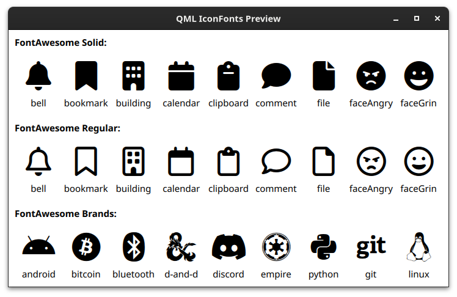

# qml-icon-fonts

Use icon fonts in QML.

## Example



## Usage

1. Add `qml-icon-fonts` as a submodule to your repository.
2. Include the subdirectory in the `CMakeLists.txt` and link against the plugin:
    ```cmake
    add_subdirectory(thirdparty/IconFonts)

    qt_add_executable(app ...)

    target_link_libraries(
        icon-fonts-example
        PRIVATE qml-icon-fontsplugin)
    ```
3. Use in QML files:
    ```qml
    import IconFonts

    Text {
        text: FontAwesome.bell
        font.family: FontAwesome.fontSolid.family
        font.styleName: FontAwesome.fontSolid.styleName
    }
    ```

### Notes

All icon names are written in camelCase and all names that start with digits or are reserved keywords start with an underscore:

| QML                     | Original    |
| ----------------------- | ----------- |
| `FontAwesome.faceGrin`  | `face-grin` |
| `FontAwesome._print`    | `print`     |
| `FontAwesome._children` | `children`  |
| `FontAwesome._0`        | `0`         |


## Included Fonts

| Font                                            | Version |
| ----------------------------------------------- | ------- |
| [Font Awesome](https://fontawesome.com/) (free) | 6.4.2   |

Currently only Font Awesome is supported, but more fonts are planned for future releases.

## Credits

This project was inspired by [FontAwesome.pri](https://github.com/benlau/fontawesome.pri).